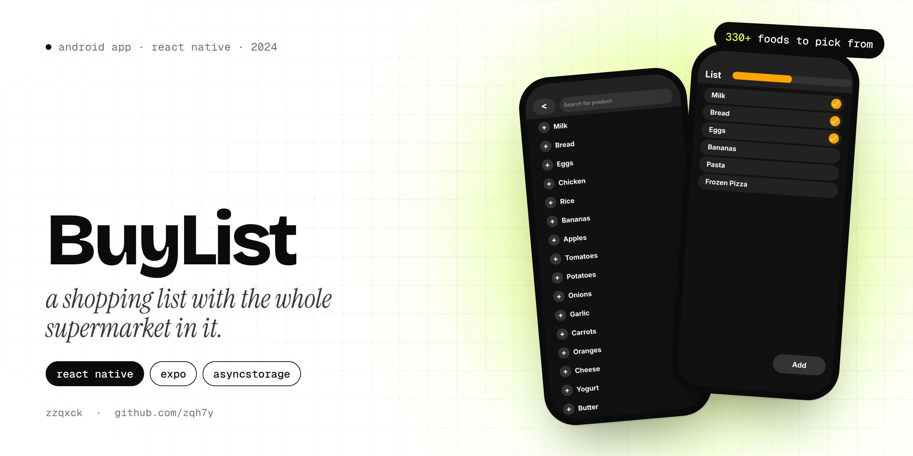
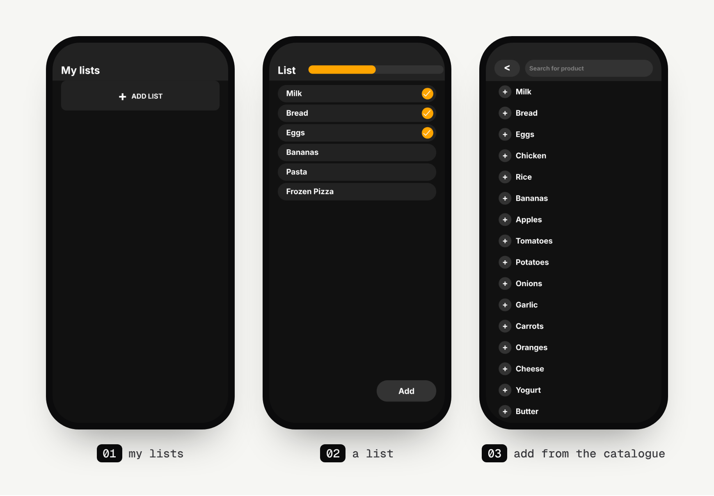

<p align="center">
  
</p>

<p align="center">
  
  
  
</p>

# BuyList

BuyList is a shopping list app. Instead of typing every item, you pick from a built-in catalogue of over 330 foods (milk, bread, eggs, all the way to biscotti), then tick things off in the shop while a progress bar fills up.

It's a small 2024 project with a dark, simple UI. The kind of app you actually open in a supermarket.

## Screens

<p align="center">
  
</p>

<sub>The list in the screenshots is sample data.</sub>

## Features

- **A food catalogue** of 330+ items you can search as you type and add with one tap.
- **Tick items off.** Tap an item to mark it as bought, and the bar at the top shows how much of the list is done.
- **Saved on the phone.** Your list is stored with AsyncStorage, so it's still there next time.
- Dark UI with rounded cards, built with plain React Native styles.

**Unfinished part:** the hand-off from the catalogue to the list. Items you pick are saved (`selectedItems`), but the list screen reads its own `savedFoods` key and doesn't pick them up yet.

## How it's built

| Part | Tech |
|---|---|
| Framework | React Native 0.74, Expo SDK 51 |
| Navigation | React Navigation (stack) |
| Storage | `@react-native-async-storage/async-storage` |
| Icons | `@expo/vector-icons` |

Three screens in `screens/` (`Home`, `Config` for the list itself, `Food` for the catalogue), and the catalogue is a plain array in `js/List.js`.

## Run it yourself

```bash
git clone https://github.com/zqh7y/BuyList.git
cd BuyList
npm install
npx expo start
```

Scan the QR code with Expo Go, or press `a` for an Android emulator.

---

<p align="center">
  Made by <b>zzqxck</b> · <a href="https://zqh7y.github.io/Portfolio/">portfolio</a> · <a href="https://github.com/zqh7y">more projects</a>
</p>
